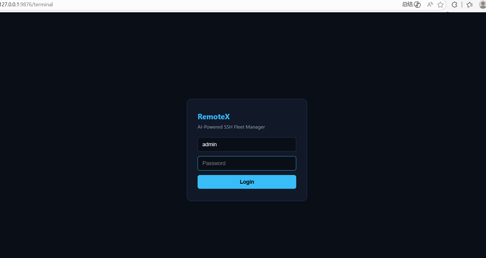
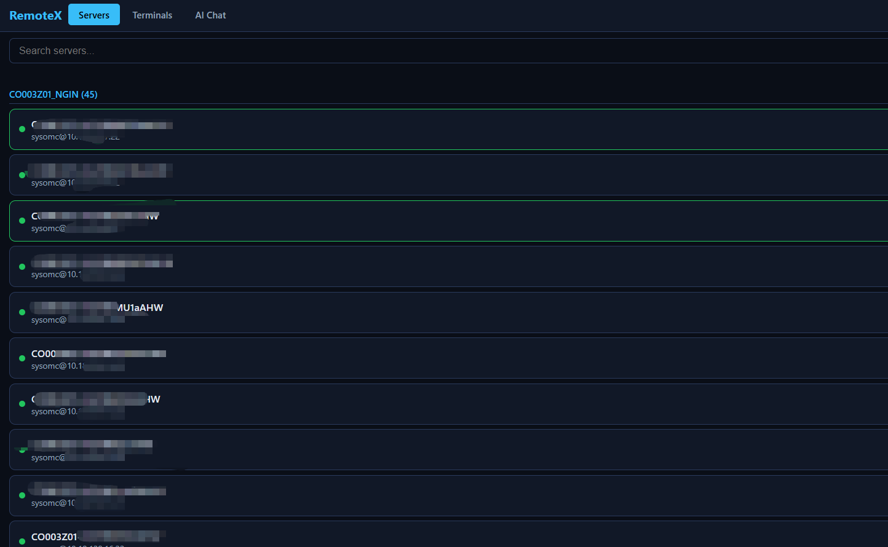
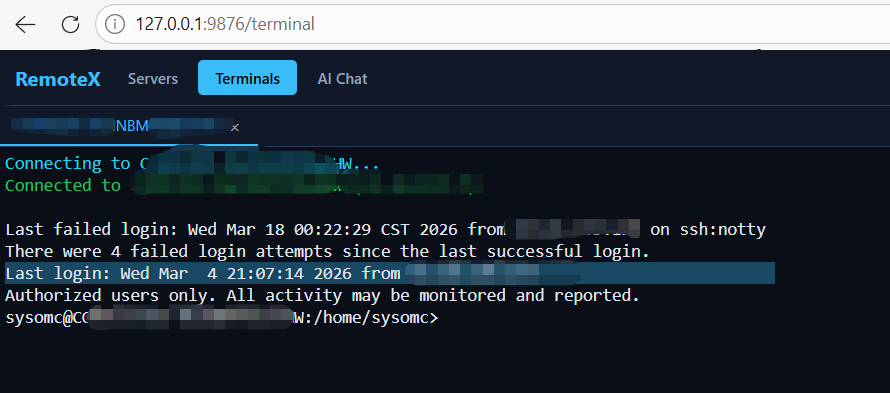
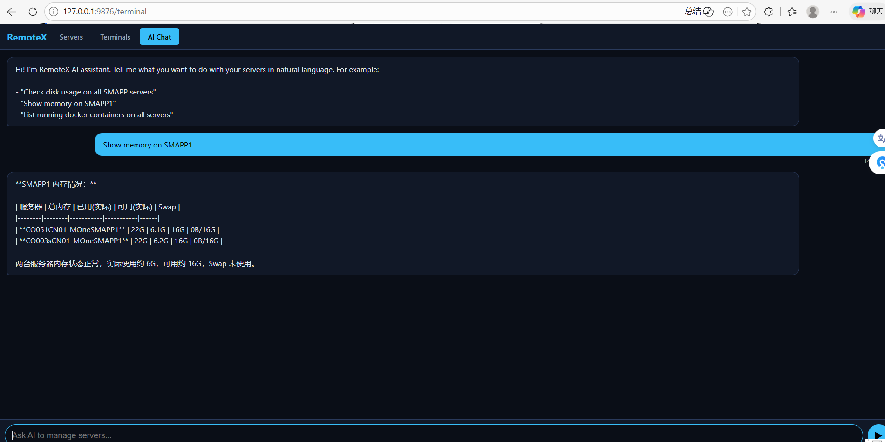
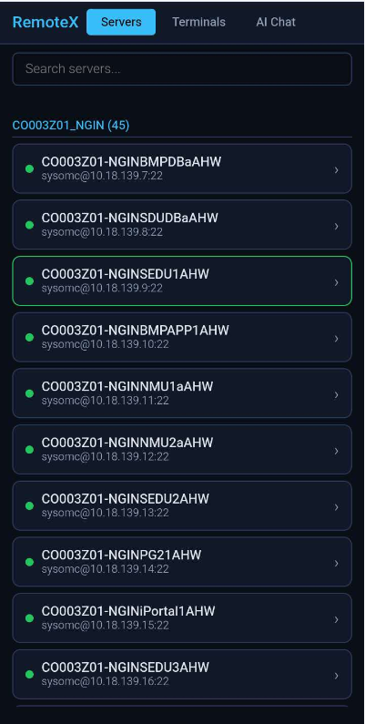
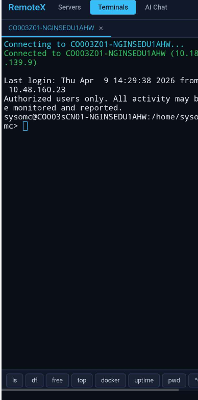
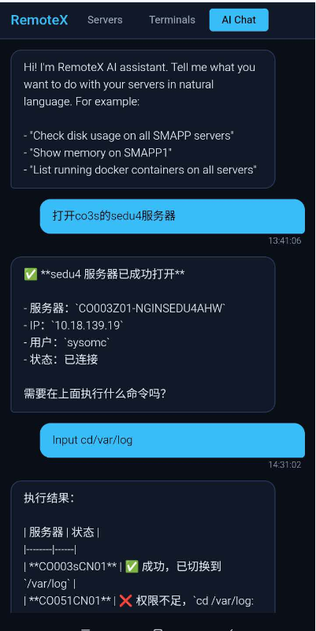

# RemoteX v0.4.0

**AI-native SSH fleet management: Desktop GUI + Mobile Web Terminal + Claude Code MCP**

Manage hundreds of SSH servers from your desktop or phone. RemoteX combines a **PyQt5 desktop GUI**, a **mobile web terminal**, **AI-powered natural language control**, and a **Claude Code MCP server** with 38 tools -- all in one package.

---

## Desktop Web Interface

### Login

Secure authentication protects your server fleet. Access the web terminal at `http://<ip>:9876/terminal` from any browser. The cyberpunk-styled login page supports Basic Auth with configurable credentials.



### Server Browser

After login, the **Servers** tab displays all configured servers organized by group. The top navigation bar provides quick switching between Servers, Terminals, and AI Chat. A search box lets you filter servers by name, IP, or group. Click any server card to instantly open an SSH connection -- no need to start the desktop GUI first.



### Web SSH Terminal

The **Terminals** tab provides a full xterm.js terminal with 256-color support, tab completion, and cursor control. Multiple servers can be opened as tabs simultaneously. Each tab maintains an independent SSH session. The tab bar at the top shows all open connections with close buttons for easy session management.



### AI Chat (Desktop)

The **AI Chat** tab lets you manage servers using natural language. Type a request like "Show memory on SMAPP1" and the AI automatically opens SSH connections, executes commands, and returns a formatted summary. Results are displayed in a clean chat interface with tables and status indicators. Powered by Claude CLI, it can handle complex multi-server operations in a single request.



---

## Mobile Interface

All features work seamlessly on mobile phones. The responsive design adapts to small screens with touch-friendly controls.

### Mobile Server Browser

The mobile server list shows all configured servers grouped by category. Green dots indicate available servers. Tap a server name to connect. The search bar at the top filters the list as you type. The interface loads all servers from `ssh_config.json` directly -- the desktop GUI doesn't need to be running.



### Mobile SSH Terminal

A full SSH terminal on your phone. The xterm.js terminal supports input, backspace, arrow keys, and tab completion. A quick command bar at the bottom provides one-tap access to common commands: `ls`, `df`, `free`, `top`, `docker`, `uptime`, `pwd`, and `Ctrl+C`. Multiple terminal tabs can be opened simultaneously, each with its own SSH session.



### Mobile AI Chat

The most powerful feature for mobile: manage your entire server fleet with natural language from your phone. In this example, the user types "open co3s sedu4 server" and the AI automatically finds the matching server, opens an SSH connection, and confirms success. Then the user sends "cd /var/log" and the AI executes it across servers and reports the results with status indicators. No typing SSH commands on a tiny keyboard -- just describe what you want in plain language.



---

## Features

| Feature | RemoteX | mcp-ssh-manager | ssh-mcp-server | SSGui |
|---|---|---|---|---|
| GUI SSH terminal (multi-tab) | Yes | No | No | Yes |
| **Mobile Web SSH terminal** | **Yes** | No | No | No |
| **AI Chat (natural language)** | **Yes** | No | No | No |
| Claude Code MCP integration | 38 tools | 37 tools | 5 tools | No |
| Batch file editing (batch vi) | Yes | No | No | No |
| HTTP API for AI control | Yes | No | No | No |
| WebSocket real-time terminal | Yes | No | No | No |
| Config drift detection | Yes | No | No | No |
| System monitoring | Yes | Yes | No | No |

## Architecture

```
+-------------------+     HTTP API (9876)     +------------------+
|   Claude Code     | <---------------------> |   RemoteX.py     |
|   (AI Agent)      |                         |   PyQt5 GUI      |
+-------------------+                         |   SSH Terminals   |
        |                                     +------------------+
        | MCP (stdio)                                |
        v                                            | paramiko SSH
+-------------------+                                v
|   mcp-server.js   |                         +-----------+
|   38 tools        | -------- ssh2 -------> | Servers    |
|   bridge.js       |                         | (N hosts)  |
+-------------------+                         +-----------+

+-------------------+     WebSocket (9877)    +------------------+
|   Mobile Browser  | <---------------------> |   RemoteX.py     |
|   xterm.js        |                         |   Web Terminal   |
|   AI Chat         | ---- HTTP API (9876) -> |   Claude CLI     |
+-------------------+                         +------------------+
```

## Quick Start

### 1. Install dependencies

```bash
# Node.js MCP server
cd RemoteX && npm install

# Python GUI + Web terminal
pip install -r requirements.txt
```

### 2. Add servers

Create `ssh_config.json` in the project root:
```json
[
  {"name": "prod-01", "host": "10.0.1.10", "port": 22, "username": "root", "password": "xxx", "group": "production"},
  {"name": "prod-02", "host": "10.0.1.11", "port": 22, "username": "root", "password": "xxx", "group": "production"}
]
```

Or import from ip.txt:
```bash
# format: name,host,port,username,password,group
npx remotex import ip.txt
```

### 3. Launch

```bash
python RemoteX.py
```

This starts:
- **Desktop GUI** on screen (PyQt5 multi-tab SSH terminal)
- **HTTP API** on `http://0.0.0.0:9876`
- **WebSocket terminal** on `ws://0.0.0.0:9877`

### 4. Mobile access

Open on your phone (same network):
```
http://<your-pc-ip>:9876/terminal
```

Three tabs available:
- **Servers** -- browse and connect to any configured server
- **Terminals** -- multi-tab xterm.js SSH terminal with quick commands
- **AI Chat** -- natural language server management

### 5. Register MCP with Claude Code

```bash
claude mcp add remotex node /path/to/RemoteX/src/mcp-server.js
```

## AI Chat Examples

The AI Chat works on both desktop and mobile. Just describe what you want:

```
"Check disk usage on all SMAPP servers"     -> runs df -h on all matching servers
"Show memory on SMAPP1"                      -> runs free -m and summarizes
"Open the sedu4 server"                      -> finds and connects to the server
"Restart nginx on all production servers"    -> opens connections + restarts
"List running docker containers"             -> runs docker ps across fleet
"cd /var/log"                                -> executes on connected servers
```

The AI will automatically:
1. Find matching servers from your configuration
2. Open SSH connections if none are active
3. Execute the appropriate commands
4. Summarize results in a mobile-friendly format with status indicators

## MCP Tools (38)

### Core SSH Operations
| Tool | Description |
|---|---|
| `ssh_exec` | Execute command on a server |
| `ssh_exec_batch` | Execute command on multiple servers |
| `ssh_list_servers` | List all configured servers |
| `ssh_list_groups` | List server groups |
| `ssh_add_server` | Add a server |
| `ssh_remove_server` | Remove a server |

### File Operations
| Tool | Description |
|---|---|
| `ssh_read_file` | Read a remote file (with line range support) |
| `ssh_write_file` | Write/append/insert to a remote file |
| `ssh_replace_in_file` | Find & replace text in a file |
| `ssh_edit_block` | Edit a text block without full rewrite (token-efficient) |
| `ssh_search_code` | Grep/search code with context |
| `ssh_upload_file` | Upload via SFTP |
| `ssh_download_file` | Download via SFTP |
| `ssh_list_dir` | List directory contents |
| `ssh_find_files` | Search by filename or content |
| `ssh_stat_file` | File metadata (size, perms, mtime) |
| `ssh_mkdir` | Create directory |
| `ssh_delete_file` | Delete file/directory (safety guards) |
| `ssh_move_file` | Move/rename |
| `ssh_copy_file` | Copy file/directory |
| `ssh_project_structure` | Project directory tree |

### Batch Operations
| Tool | Description |
|---|---|
| `ssh_import_servers` | Import from ip.txt |
| `ssh_clear_all_servers` | Remove all servers from config |
| `ssh_batch_read_file` | Read same file from N servers |
| `ssh_batch_write_file` | Write same file to N servers |
| `ssh_batch_replace_in_file` | Find/replace across N servers |
| `ssh_diff_files` | Compare same file across servers (drift detection) |
| `ssh_batch_upload` | Upload to multiple servers |
| `ssh_sync_file` | Copy file between servers |

### System Monitoring
| Tool | Description |
|---|---|
| `ssh_server_info` | Full system info |
| `ssh_health_check` | CPU, memory, disk, load, uptime |
| `ssh_batch_health_check` | Health check across N servers |
| `ssh_process_list` | Top processes (filterable) |
| `ssh_docker_status` | Docker containers, images, stats |
| `ssh_network_info` | Interfaces, routes, connections, DNS |
| `ssh_service` | Start/stop/restart systemd services |
| `ssh_ports` | List listening ports |
| `ssh_tail_log` | Tail remote log files |

## HTTP API

When running RemoteX.py, an HTTP API server starts on port 9876.

```bash
# Read
curl -u admin:password http://localhost:9876/sessions
curl -u admin:password http://localhost:9876/servers
curl -u admin:password "http://localhost:9876/output?server=SERVER&lines=50"
curl -u admin:password "http://localhost:9876/exec?server=SERVER&command=hostname&wait=2"

# Write
curl -u admin:password -X POST http://localhost:9876/send -d '{"server":"SERVER","command":"df -h"}'
curl -u admin:password -X POST http://localhost:9876/broadcast -d '{"command":"uptime"}'
curl -u admin:password -X POST http://localhost:9876/open -d '{"filter":"KEYWORD"}'
curl -u admin:password -X POST http://localhost:9876/exec_all -d '{"command":"hostname","wait":3}'

# Web terminal (no auth for page load)
GET /terminal
```

## Configuration

### ssh_config.json
```json
[
  {
    "name": "server-name",
    "host": "10.0.1.10",
    "port": 22,
    "username": "root",
    "password": "...",
    "group": "production"
  }
]
```

### ip.txt format
```
# name,host,port,username,password,group
prod-web-01,10.0.1.10,22,root,password,production
prod-web-02,10.0.1.11,22,root,password,production
```

### CLI Commands
```bash
npx remotex list [-c]                            # List servers
npx remotex exec <server> <cmd>                  # Execute command
npx remotex batch <group> <cmd>                  # Batch execute
npx remotex import <file>                        # Import from ip.txt
npx remotex batch-cat <group> <path>             # Batch read file
npx remotex batch-replace <group> <path> <old> <new>  # Batch replace
```

## Network Access

### Same Network (LAN)

1. Open firewall ports on PC:
```bash
netsh advfirewall firewall add rule name="RemoteX HTTP" dir=in action=allow protocol=TCP localport=9876
netsh advfirewall firewall add rule name="RemoteX WebSocket" dir=in action=allow protocol=TCP localport=9877
```

2. Access from phone: `http://192.168.x.x:9876/terminal`

### Remote Access (Any Network)

To access RemoteX from anywhere (different WiFi, cellular, remote location), use **[Tailscale](https://tailscale.com)** -- a free mesh VPN that creates a secure encrypted tunnel between your devices.

1. **Install Tailscale** on PC (`winget install Tailscale.Tailscale`) and phone ([iOS](https://apps.apple.com/app/tailscale/id1470499037) / [Android](https://play.google.com/store/apps/details?id=com.tailscale.ipn))
2. **Login with the same account** on both devices
3. **Access from anywhere:** `http://100.x.x.x:9876/terminal`

Why Tailscale:
- Zero config -- no port forwarding, no public IP needed
- End-to-end encrypted (WireGuard)
- Works through NAT, firewalls, cellular networks
- Free for personal use

**Alternative:** [Cloudflare Tunnel](https://developers.cloudflare.com/cloudflare-one/connections/connect-networks/) for HTTPS access with custom domain.

## License

MIT
